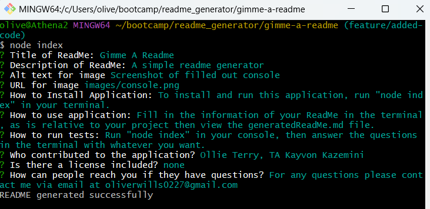

  # Gimme A Readme

  ## Table of Contents
  * [Description](#description)
  * [Installation](#installation)
  * [Usage](#usage)
  * [Tests](#tests)
  * [Contributors](#contributors)
  * [Questions](#questions)

  ## Description
  A simple readme generator

  
  
  

  ## Installation
  To install and run this application, run "node index" in your terminal.

  ## Usage
  Fill in the information of your ReadMe in the terminal, as is relative to your project then view the generatedReadMe.md file.

  ## Tests
  Run "node index" in your console, then answer the questions in the terminal with whatever you want.

  ## Contributors
  Ollie Terry, TA Kayvon Kazemini 

  ## Questions
  For any questions please contact me via email at oliverwills0227@gmail.com 

  ## Other
  This ReadMe was created using the generator.
  The video of the ReadMe generator is too big for the ReadMe, so you'll have to view/download the raw file. 
  
