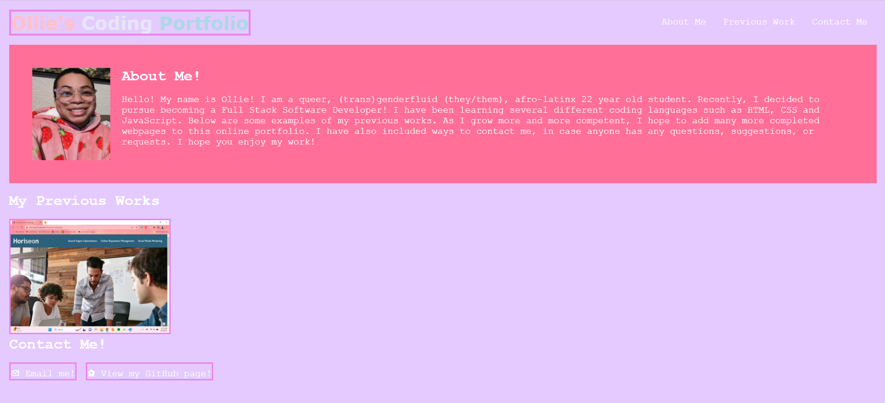

  
  # Pink Coding Portfolio

  ## Table of Contents
  * [Description](#description)
  * [Installation](#installation)
  * [Usage](#usage)
  * [Tests](#tests)
  * [Contributors](#contributors)
  * [Questions](#questions)
  * [License](#license)

  ## Description
  A pink-themed portfolio of my completed projects.

  

  ## Installation
  This website does not install, instead simply click on the following link: [Pink Coding Portfolio](https://otmorales23.github.io/pink-coding-portfolio/)

  ## Usage
  Once you've opened the webpage, scroll through and click on the navigation bar or any images of works to be redirected to their respective sites.

  ## Tests
  N/A

  ## Contributors
  Ollie Terry-Morales

  ## Questions
  If you have any questions don't hestitate to reach out to via email at oliverwills0227@gmail.com

  ## License 
    This project is licensed with MIT

